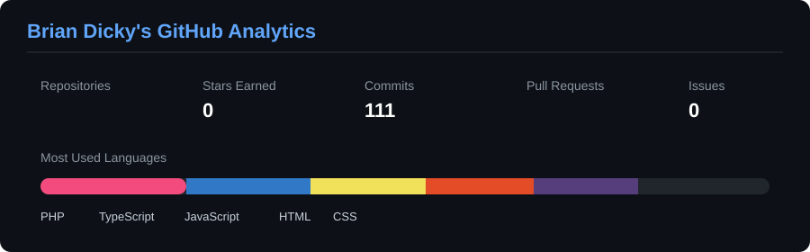

<h1 align="center">Hi 👋, I'm Brian Dicky Vanka Andaraneva</h1>

  

---

<table width="100%">
  <tr>
    <td width="65%" valign="top">
      

        <b>Hello there!</b> I'm <b>Brian Dicky Vanka Andaraneva</b>, an Informatics undergraduate at <b>UPN "Veteran" Jawa Timur</b> with a strong interest in fullstack web development and practical software engineering.
          
        My technical journey focuses on <b>Laravel, PHP, JavaScript, React, MySQL, REST APIs</b>, and modern web technologies. I enjoy building practical applications, working with backend systems, databases, and continuously improving my development skills.
      

    </td>
    <td width="35%" align="center" valign="middle">
      
    </td>
  </tr>
</table>

<b><i>❝ Always learning. Always building. ❞</i></b>

---

<h3> About Me</h3>

- 🎓 Informatics undergraduate at <b>UPN "Veteran" Jawa Timur</b>
- 💻 Fullstack Developer at <b>Javatekno Mitra Solusi</b>
- 🚀 Currently developing <b>PUSATKOS</b> with Laravel & PHP
- 🤖 Participating in <b>Asah by Dicoding</b> as an AI Full-Stack Developer
- 🧩 Interested in fullstack web development, backend systems, and practical software projects
- 📚 Continuously learning modern web development and software engineering

---

 <b>Technology Stack</b>

 

<h4>Programming Languages</h4>

  
  
  
  
  
  

<h4>Frameworks & Libraries</h4>

  
  
  
  
  

<h4>Database & Services</h4>

  

<h4>Tools & Platforms</h4>

  
  
  
  
  

---

 <b>GitHub Analytics</b>

 

  
  

 

<h3 align="center"> Additional GitHub Analytics</h3>

  

---

  <h3> Connect With Me</h3>
  
  
  
    
  <h3> Profile Views</h3>
  
    
  
Created with 🖤 by <a href="https://github.com/briandicky09">Brian Dicky</a>

